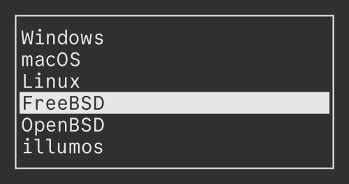

# Bashmenu
[English](README.md) | 日本語



Bashmenuは与えられた引数から項目を選択するためのミニマルなTUIツールです。

Bashで書かれており、追加の依存関係を必要としません！

## インストール
```sh
git clone https://codeberg.org/qdz13/bashmenu.git
cd bashmenu
sudo make install
```

## 使い方
```sh
bashmenu "one" "two" "three"
```

オプションやキーバインドの説明を見るには`man bashmenu`を実行してください。

> [!TIP]
> ディレクトリ「examples」内にいくつかスクリプトの例があります。
