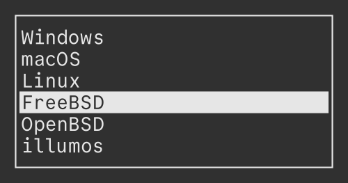

# Bashmenu
English | [日本語](README-ja.md)



Bashmenu is a minimal TUI tool for choosing one from a given arguments.

It's written in Bash, and does not require additional dependencies!

## Installation
```sh
git clone https://codeberg.org/qdz13/bashmenu.git
cd bashmenu
sudo make install
```

## Usage
```sh
bashmenu "one" "two" "three"
```

Run `man bashmenu` to see the explanation of options and key binds.

> [!TIP]
> There are several example scripts in the directory named "examples".
